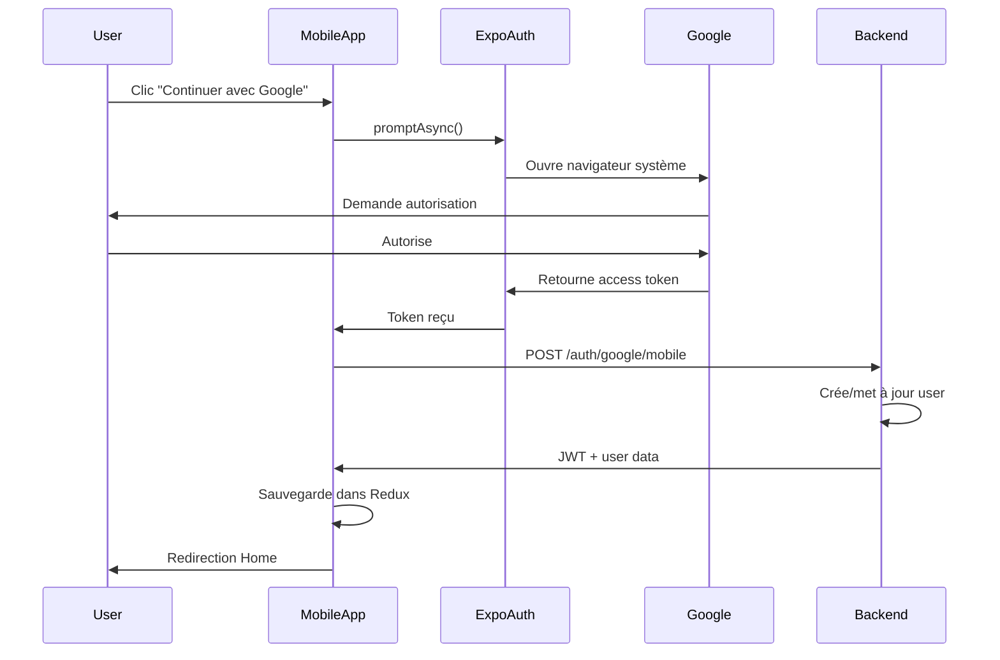

# 🔐 Authentification Google - Mobile React Native

## 📚 Documentation

Ce dossier contient l'implémentation complète de l'authentification Google pour l'application mobile React Native avec Expo.

### 📖 Guides disponibles

1. **[GOOGLE_CONSOLE_QUICKSTART.md](./GOOGLE_CONSOLE_QUICKSTART.md)** ⚡
   - Guide rapide (5 min)
   - Configuration Google Cloud Console
   - Création des Client IDs
   - **👉 COMMENCEZ ICI**

2. **[GOOGLE_AUTH_SETUP.md](./GOOGLE_AUTH_SETUP.md)** 📘
   - Guide complet et détaillé
   - Architecture du flux
   - Debugging
   - Déploiement en production

3. **[IMPLEMENTATION_SUMMARY.md](./IMPLEMENTATION_SUMMARY.md)** 📝
   - Résumé des modifications
   - Checklist de vérification
   - Points de contrôle

4. **[testGoogleAuth.ts](./testGoogleAuth.ts)** 🧪
   - Script de test de configuration
   - Vérification des variables d'environnement
   - Test de connectivité backend

---

## 🚀 Démarrage Rapide

### 1. Installer les dépendances
```bash
npx expo install expo-auth-session expo-crypto expo-web-browser
```

### 2. Configurer Google Cloud Console
Suivre [GOOGLE_CONSOLE_QUICKSTART.md](./GOOGLE_CONSOLE_QUICKSTART.md)

### 3. Configurer les variables d'environnement
Éditer `.env`:
```env
EXPO_PUBLIC_GOOGLE_CLIENT_ID_IOS=YOUR_IOS_CLIENT_ID.apps.googleusercontent.com
EXPO_PUBLIC_GOOGLE_CLIENT_ID_ANDROID=YOUR_ANDROID_CLIENT_ID.apps.googleusercontent.com
EXPO_PUBLIC_GOOGLE_CLIENT_ID_WEB=YOUR_WEB_CLIENT_ID.apps.googleusercontent.com
```

### 4. Tester
```bash
# Terminal 1: Backend
cd ../server
npm run dev

# Terminal 2: Mobile
npx expo start
```

---

## 📁 Structure des fichiers

```
mobile-BuyandSale/
├── src/
│   ├── services/
│   │   └── googleAuthService.ts          # 🆕 Service d'auth Google
│   ├── pages/
│   │   └── auth/
│   │       └── Login/
│   │           ├── index.tsx              # ✏️ Modifié (bouton Google)
│   │           └── style.ts               # ✏️ Modifié (styles)
│   └── store/
│       └── authentification/
│           └── actions.ts                 # ✅ handleSocialAuthCallback déjà présent
├── app.json                               # ✏️ Modifié (scheme, bundleId)
├── .env                                   # ✏️ Modifié (Client IDs)
├── GOOGLE_CONSOLE_QUICKSTART.md          # 🆕 Guide rapide
├── GOOGLE_AUTH_SETUP.md                  # 🆕 Guide complet
├── IMPLEMENTATION_SUMMARY.md             # 🆕 Résumé
└── testGoogleAuth.ts                     # 🆕 Script de test
```

---

## 🔧 Technologies utilisées

- **Expo AuthSession** - Gestion OAuth2 native
- **expo-web-browser** - Ouverture du navigateur système
- **expo-crypto** - Génération de codes sécurisés (PKCE)
- **Redux Toolkit** - Gestion de l'état d'authentification

---

## 🎯 Fonctionnalités

- ✅ Authentification Google native (Safari/Chrome)
- ✅ Support iOS et Android
- ✅ Gestion automatique du PKCE (sécurité)
- ✅ Création/liaison automatique de compte
- ✅ Vérification du statut (ACTIVE/SUSPENDED/BANNED)
- ✅ Multi-device support
- ✅ Gestion des erreurs complète
- ✅ État de chargement pendant l'auth

---

## 🐛 Problèmes courants

### "Client ID non configuré"
**Solution:** 
1. Vérifier que `.env` contient `EXPO_PUBLIC_GOOGLE_CLIENT_ID_*`
2. Redémarrer Expo: `npx expo start --clear`

### "Redirect URI mismatch"
**Solution:**
Ajouter dans Google Console:
```
https://auth.expo.io/@YOUR_USERNAME/buy_and_sale
```

### Backend non accessible
**Solution:**
1. Vérifier que le backend est démarré
2. Vérifier l'URL dans `.env`: `API_URL=http://...`
3. Pour Android émulateur: utiliser `10.0.2.2` au lieu de `localhost`

---

## 📊 Flux d'authentification



---

## ✅ Checklist finale

Avant de tester:
- [ ] Dépendances Expo installées
- [ ] Google Client IDs créés (iOS + Android)
- [ ] SHA-1 Android configuré dans Google Console
- [ ] Redirect URIs ajoutés dans Google Console
- [ ] Variables `.env` configurées
- [ ] Backend démarré et accessible
- [ ] Expo redémarré après modification `.env`

---

## 🚀 Prochaines étapes

1. **Test sur appareil réel** (recommandé)
2. **Configuration pour production** (EAS Build)
3. **Ajout page Register** (même logique)
4. **Tests end-to-end**

---

## 📞 Support

- **Documentation complète:** Voir les fichiers `.md` dans ce dossier
- **Analyse architecture:** `../docs/GOOGLE_AUTH_ANALYSIS_AND_MOBILE_IMPLEMENTATION.md`
- **Test configuration:** Exécuter `testGoogleAuth.ts`

---

**Status:** ✅ Implémentation complète  
**Version:** 1.0  
**Date:** Janvier 2026
