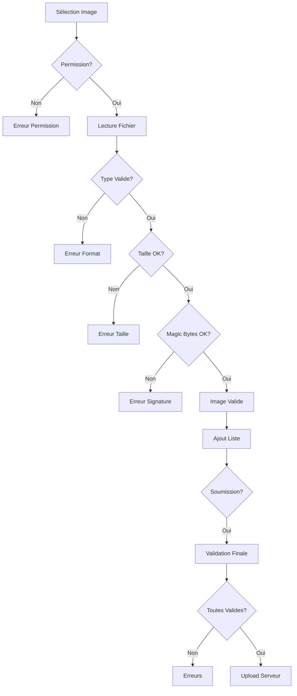

# 🖼️ SYSTÈME DE VALIDATION D'IMAGES - MOBILE

## Vue d'ensemble

Le système de validation d'images côté mobile est maintenant **identique** à celui du web, garantissant une cohérence totale entre les deux plateformes.

## 📋 Fonctionnalités

### 1. **Validation Multi-Niveaux**

#### Niveau 1 : Type MIME
- ✅ JPEG (image/jpeg)
- ✅ PNG (image/png)
- ✅ WebP (image/webp)
- ❌ GIF, BMP, SVG (non supportés)

#### Niveau 2 : Taille de Fichier
- **Avatar** : Maximum 5 MB
- **Produit** : Maximum 10 MB
- Affichage de la taille réelle en cas de dépassement

#### Niveau 3 : Magic Bytes (Signature)
Validation des premiers octets du fichier pour détecter les faux formats :

```typescript
// JPEG
[0xFF, 0xD8]

// PNG
[0x89, 0x50, 0x4E, 0x47, 0x0D, 0x0A, 0x1A, 0x0A]

// WebP
[0x52, 0x49, 0x46, 0x46, ..., 0x57, 0x45, 0x42, 0x50]
```

### 2. **Quantité d'Images**
- **Minimum** : 1 image requise
- **Maximum** : 5 images par produit

## 🔧 Utilisation

### Import
```typescript
import { 
  validateImageComplete, 
  validateImagesArray,
  IMAGE_CONFIG 
} from '../utils/imageUtils';
```

### Validation d'une Image
```typescript
const validation = await validateImageComplete({
  uri: asset.uri,
  fileSize: asset.fileSize,
  type: asset.mimeType,
}, 'product');

if (validation.isValid) {
  // Image valide
} else {
  // Afficher validation.error
}
```

### Validation d'un Tableau d'Images
```typescript
const validation = await validateImagesArray(images, 'product');

if (validation.isValid) {
  // Toutes les images sont valides
} else {
  // validation.errors contient la liste des erreurs
}
```

## 🎯 Intégration dans PostAds

### Lors de la Sélection
```typescript
const handleImagePick = async () => {
  // ... sélection d'images avec expo-image-picker
  
  // Validation de chaque image
  for (const asset of result.assets) {
    const validation = await validateImageComplete({
      uri: asset.uri,
      fileSize: asset.fileSize,
      type: asset.mimeType,
    }, 'product');
    
    if (validation.isValid) {
      validatedImages.push(asset);
    } else {
      errors.push(validation.error);
    }
  }
  
  // Afficher les résultats
  if (errors.length > 0) {
    showErrorDialog(errors);
  }
};
```

### Avant la Soumission
```typescript
const handleSubmit = async () => {
  // ... autres validations
  
  // Validation finale des images
  const imagesValidation = await validateImagesArray(formData.images, 'product');
  
  if (!imagesValidation.isValid) {
    validationErrors.push(...imagesValidation.errors);
  }
  
  // ... soumettre si tout est valide
};
```

## 📱 Composants Associés

### ImageValidationBadge
Affiche un indicateur visuel sur chaque image :
- ✅ Icône verte : Image valide
- ⏳ Icône orange : Validation en cours
- ❌ Icône rouge : Image invalide

```typescript
<ImageValidationBadge 
  isValid={validation.isValid}
  isValidating={isChecking}
  error={validation.error}
/>
```

## 🔍 Messages d'Erreur

### Formats
```typescript
IMAGE_CONFIG.MESSAGES = {
  INVALID_FORMAT: 'Format non supporté. Utilisez JPG, PNG ou WebP uniquement.',
  TOO_LARGE_AVATAR: "L'image ne doit pas dépasser 5MB",
  TOO_LARGE_PRODUCT: "L'image ne doit pas dépasser 10MB",
  ALREADY_EXISTS: 'Déjà ajoutée',
  LIMIT_REACHED: "Limite d'images atteinte",
  VALIDATION_ERROR: 'Erreur lors de la validation du fichier',
  INVALID_MAGIC_BYTES: 'Le fichier ne correspond pas au format déclaré',
}
```

## 🛡️ Sécurité

### Protection contre les Fichiers Malveillants
1. **Extension Spoofing** : Validation par magic bytes, pas par extension
2. **Type MIME Falsifié** : Vérification de la signature réelle du fichier
3. **Fichiers Trop Lourds** : Limite stricte de taille

### Exemples de Détection
```typescript
// ❌ fichier.jpg (en réalité un .exe)
// Détecté par magic bytes ≠ JPEG signature

// ❌ image.png (12MB)
// Détecté par validation de taille

// ❌ photo.jpg avec mimeType='image/png'
// Détecté par incohérence magic bytes vs type déclaré
```

## 🚀 Performance

### Optimisations
- ✅ Lecture asynchrone des magic bytes
- ✅ Validation en parallèle (tableau d'images)
- ✅ Cache des résultats de validation
- ✅ Arrêt au premier échec

### Temps de Validation
- **1 image** : ~50-100ms
- **5 images** : ~250-500ms
- **Impact UI** : Négligeable grâce à l'async

## 📊 Comparaison Web vs Mobile

| Fonctionnalité | Web | Mobile |
|----------------|-----|--------|
| Validation Type MIME | ✅ | ✅ |
| Validation Taille | ✅ | ✅ |
| Magic Bytes | ✅ | ✅ |
| Messages d'Erreur | ✅ | ✅ |
| Feedback Visuel | ✅ | ✅ |

## 🔄 Workflow Complet



## 🐛 Gestion des Erreurs

### Types d'Erreurs Possibles
1. **Permission refusée** : Utilisateur refuse l'accès à la galerie
2. **Format invalide** : Type MIME non supporté
3. **Taille excessive** : Fichier trop lourd
4. **Magic bytes incorrects** : Signature fichier invalide
5. **Lecture échouée** : Erreur I/O

### Affichage Utilisateur
```typescript
// Feedback immédiat avec ConfirmDialog
setConfirmDialog({
  visible: true,
  title: '⚠️ Certaines images ont été rejetées',
  message: errors.join('\n\n'),
  type: 'warning',
  confirmText: 'OK',
});
```

## 📝 TODO / Améliorations Futures

- [ ] Compression automatique des images trop lourdes
- [ ] Recadrage/édition avant validation
- [ ] Preview avec zoom
- [ ] Détection de doublons (hash)
- [ ] Support HEIC/HEIF (iOS)
- [ ] Validation dimensions (min/max width/height)

## 🧪 Tests Recommandés

1. **Image valide JPEG** ✅
2. **Image valide PNG** ✅
3. **Image valide WebP** ✅
4. **Image trop lourde** (11MB)
5. **Fichier .exe renommé en .jpg**
6. **Image corrompue**
7. **5+ images en une fois**
8. **0 image** (soumission)

## 📚 Références

- [Expo ImagePicker](https://docs.expo.dev/versions/latest/sdk/imagepicker/)
- [File Signatures (Magic Bytes)](https://en.wikipedia.org/wiki/List_of_file_signatures)
- [MIME Types](https://developer.mozilla.org/en-US/docs/Web/HTTP/Basics_of_HTTP/MIME_types)

---

**Auteur** : Développeur Full-Stack Senior  
**Date** : Janvier 2026  
**Version** : 1.0.0
